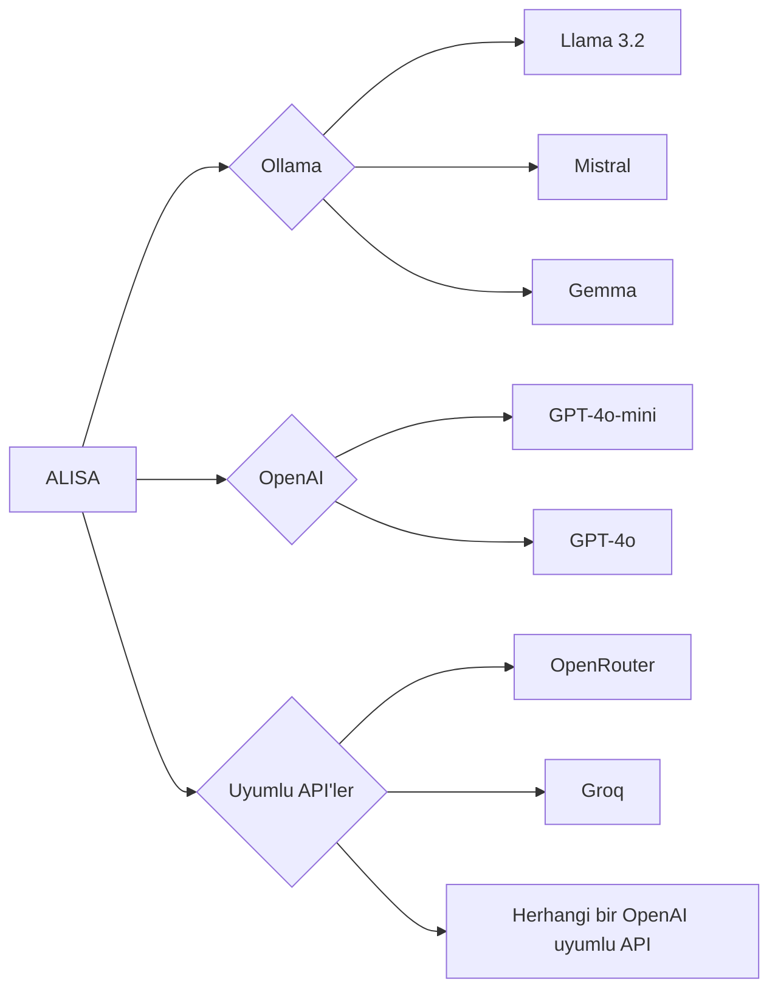

<div align="center">
  

  <h1>🤖 ALISA</h1>
  <h3>AI Local Intelligent System Assistant</h3>
  <p><i>Komutlarınla bilgisayarını yöneten yapay zeka asistanı</i></p>

  <p>
    
    
    
    
    
  </p>

  <br>

  <!-- GIF placeholder - gerçek bir demo gifi eklenebilir -->
  
  <br>
  <i>🎥 Demo gifi yakında eklenecek</i>
</div>

---

## ✨ Özellikler

<table>
<tr>
  <th width="50%">✅ Mevcut</th>
  <th width="50%">🚧 Yolda</th>
</tr>
<tr>
  <td>
    <ul>
      <li>💬 Doğal dil ile komut verme</li>
      <li>🧠 Yerel LLM desteği (Ollama)</li>
      <li>☁️ OpenAI / uyumlu API desteği</li>
      <li>📂 Dosya işlemleri (taşı, kopyala, sil, listele)</li>
      <li>📊 Sistem bilgisi sorgulama (CPU, RAM, Disk)</li>
      <li>📁 Büyük dosya bulma</li>
      <li>⚙️ Shell komutu çalıştırma</li>
    </ul>
  </td>
  <td>
    <ul>
      <li>🎤 Ses tanıma (Speech-to-Text)</li>
      <li>🔊 Ses sentezleme (Text-to-Speech)</li>
      <li>🧩 Plugin sistemi</li>
      <li>🖥️ GUI arayüzü</li>
      <li>🌐 Web araması entegrasyonu</li>
      <li>📅 Takvim / hatırlatıcı</li>
    </ul>
  </td>
</tr>
</table>

---

## 🚀 Başlarken

### 1️⃣ Ollama'yı Kur (Yerel Kullanım İçin)

```bash
# Ollama'yı indir ve kur
# https://ollama.com/download

# Modeli çek
ollama pull llama3.2
```

### 2️⃣ Projeyi Hazırla

```bash
# Sanal ortam oluştur
python -m venv venv

# Bağımlılıkları yükle
.\venv\Scripts\pip install -r requirements.txt
```

### 3️⃣ Çalıştır

```bash
# Yerel mod (Ollama)
.\venv\Scripts\python main.py

# Ses modu ile
.\venv\Scripts\python main.py --voice

# OpenAI API ile
.\venv\Scripts\python main.py --mode cloud --api-key KEY --model gpt-4o-mini
```

---

## 🎮 Kullanım

| Komut | Ne Yapar? |
|-------|-----------|
| `Masaüstündeki dosyaları listele` | 📂 Klasör içeriğini gösterir |
| `Sistem bilgimi göster` | 📊 CPU, RAM, Disk kullanımını gösterir |
| `100MB üzeri dosyaları bul` | 🔍 Büyük dosyaları tarar |
| `Belgeler klasörü oluştur` | 📁 Yeni klasör açar |
| `Bu dosyayı şuraya taşı` | 📦 Dosya taşıma işlemi yapar |

---

## 🧠 LLM Sağlayıcıları



---

## 📁 Proje Yapısı

```
📦 alisa/
├── 📄 main.py                 # Giriş noktası
├── 📄 requirements.txt        # Bağımlılıklar
├── 📄 .gitignore
├── 📄 README.md
│
├── 📁 alisa/
│   ├── 📄 __init__.py
│   │
│   ├── 📁 core/
│   │   ├── 📄 assistant.py    # Ana asistan mantığı
│   │   ├── 📄 commands.py     # Sistem komut motoru
│   │   └── 📄 llm.py          # LLM entegrasyonu
│   │
│   ├── 📁 voice/
│   │   ├── 📄 stt.py          # Speech-to-Text
│   │   └── 📄 tts.py          # Text-to-Speech
│   │
│   └── 📁 plugins/            # Plugin sistemi (yolda)
│       └── 📄 __init__.py
│
└── 📁 venv/                   # Sanal ortam
```

---

## 🛠️ Geliştirme

Katkıda bulunmak ister misin?

1. Fork'la
2. Branch aç: `git checkout -b yeni-ozellik`
3. Değişiklikleri yap
4. Pushla: `git push origin yeni-ozellik`
5. PR aç

```bash
# Geliştirme bağımlılıkları
pip install pytest black ruff
```

---

## 📸 Ekran Görüntüleri


<i>🖼️ Ekran görüntüsü yakında eklenecek</i>

---

<div align="center">
  
  
  <p>
    <b>⭐ Star'lamayı unutma!</b>
  </p>
  
  <p>
    <a href="https://github.com/Quadraxx">👤 Quadraxx</a>
    ·
    <a href="https://github.com/Quadraxx/alisa/issues">🐛 Hata Bildir</a>
    ·
    <a href="https://github.com/Quadraxx/alisa/discussions">💬 Tartışma</a>
  </p>
  
  <p>
    
    
  </p>
</div>
