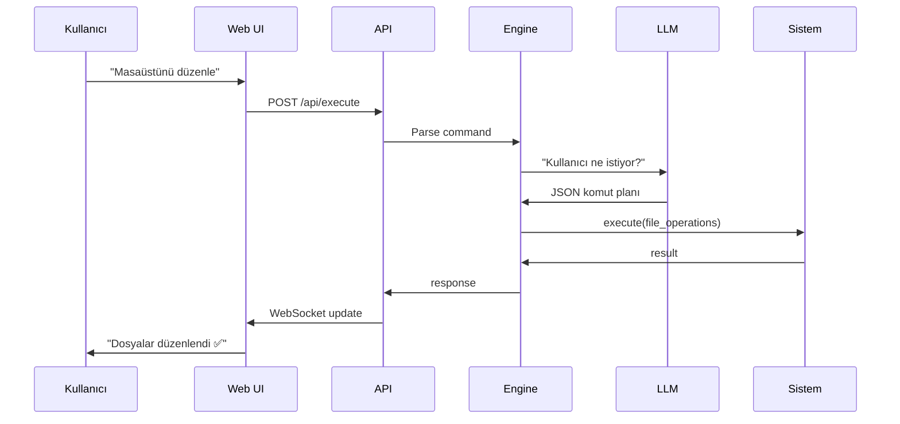
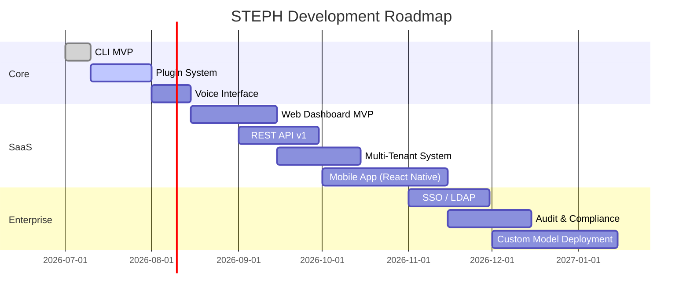

<div align="center">
  

  <h1>🤖 STEPH</h1>
  <h3>AI-Powered System Management Platform</h3>
  <p><i>Bir sonraki işletim sisteminiz. AI-native, cloud-connected, her yerden yönetin.</i></p>

  <p>
    
    
    
    
  </p>

  <br>

  <table>
    <tr>
      <td align="center"><b>⭐ 0</b></td>
      <td align="center"><b>🍴 0</b></td>
      <td align="center"><b>🐛 0</b></td>
      <td align="center"><b>💻 1</b></td>
    </tr>
    <tr>
      <td>Stars</td>
      <td>Forks</td>
      <td>Issues</td>
      <td>Contributors</td>
    </tr>
  </table>
</div>

---

## 📋 İçindekiler

- [🎯 Vizyon](#-vizyon)
- [✨ Özellikler](#-özellikler)
- [🏗️ Mimari](#️-mimari)
- [🚀 Hızlı Başlangıç](#-hızlı-başlangıç)
- [☁️ SaaS Platform](#️-saas-platform)
- [📊 API](#-api)
- [🔐 Güvenlik](#-güvenlik)
- [📈 Yol Haritası](#-yol-haritası)
- [🤝 Katkıda Bulunun](#-katkıda-bulunun)
- [📄 Lisans](#-lisans)

---

## 🎯 Vizyon

STEPH, bilgisayarınızı yönetme şeklinizi kökten değiştiren **AI-native bir platformdur**. Geleneksel işletim sistemi arayüzlerinin ötesine geçerek, doğal dil ile bilgisayarınızı yönetmenizi sağlar.

> *"İşletim sisteminin yeni dili: Doğal Dil"*

### Neden STEPH?

| Problem | STEPH Çözümü |
|---------|--------------|
| Karmaşık menüler, uzun tıklama yolları | Tek cümle ile işlem |
| Script yazmayı bilmeyenler için otomasyon zor | Doğal dil ile otomasyon |
| Sistem yönetimi için teknik bilgi gerekli | AI her seviyeden kullanıcıya hitap eder |
| Farklı araçlar arasında geçiş yapma | Tek platform, her şey |

---

## ✨ Özellikler

<div align="center">
  <h3>🔹 Şu Anda 🔹</h3>
</div>

<table>
  <tr>
    <td align="center">🧠</td>
    <td width="80%"><b>Multi-LLM Desteği</b><br/>Ollama (yerel), OpenAI, OpenRouter, Groq - dilediğiniz modeli kullanın</td>
  </tr>
  <tr>
    <td align="center">📂</td>
    <td width="80%"><b>AI Dosya Yönetimi</b><br/>"Masaüstünü düzenle" deyin, AI dosyalarınızı kategorize etsin</td>
  </tr>
  <tr>
    <td align="center">📊</td>
    <td width="80%"><b>Sistem İzleme</b><br/>Anlık CPU, RAM, Disk takibi - doğal dil ile sorgulayın</td>
  </tr>
  <tr>
    <td align="center">🔍</td>
    <td width="80%"><b>Akıllı Dosya Tarama</b><br/>Büyük dosyaları, eski dosyaları, tekrarlananları bulun</td>
  </tr>
  <tr>
    <td align="center">⚡</td>
    <td width="80%"><b>Komut Çalıştırma</b><br/>Shell komutlarını güvenlik katmanı ile çalıştırın</td>
  </tr>
</table>

<div align="center">
  <h3>🔸 SaaS Cloud Özellikleri (Çok Yakında) 🔸</h3>
</div>

<table>
  <tr>
    <td align="center">🌐</td>
    <td width="80%"><b>Web Dashboard</b><br/>Tarayıcı üzerinden makinelerinizi yönetin, anlık görüntü alın</td>
  </tr>
  <tr>
    <td align="center">🔗</td>
    <td width="80%"><b>REST API</b><br/>Her şey API ile kontrol edilebilir - kendi uygulamanızı entegre edin</td>
  </tr>
  <tr>
    <td align="center">👥</td>
    <td width="80%"><b>Multi-Tenant</b><br/>Kurumsal ekipler için rol tabanlı erişim, takım yönetimi</td>
  </tr>
  <tr>
    <td align="center">📱</td>
    <td width="80%"><b>Mobil Uygulama</b><br/>Telefonunuzdan bilgisayarınıza komut verin</td>
  </tr>
  <tr>
    <td align="center">📈</td>
    <td width="80%"><b>Analitik & Raporlama</b><br/>Sistem kullanım raporları, AI önerileri, trend analizi</td>
  </tr>
  <tr>
    <td align="center">🔄</td>
    <td width="80%"><b>Otomasyon Tetikleyicileri</b><br/>"CPU %90'ı geçince uyar" gibi akıllı kurallar</td>
  </tr>
</table>

---

## 🏗️ Mimari

```
┌─────────────────────────────────────────────────────────┐
│                    🌐 Web Dashboard                      │
│              (React + Tailwind + WebSocket)              │
├─────────────────────────────────────────────────────────┤
│                    🔗 REST API Gateway                   │
│                   (FastAPI + JWT Auth)                   │
├────────────────────┬────────────────────────────────────┤
│                    │                                     │
│   ┌────────────────▼────────────────┐                   │
│   │        🧠 Core Engine           │                   │
│   │  ┌──────────────────────────┐   │                   │
│   │  │ 📋 Command Parser &      │   │                   │
│   │  │   Executor               │   │                   │
│   │  ├──────────────────────────┤   │                   │
│   │  │ 🤖 LLM Orchestrator     │   │                   │
│   │  │  ├─ Ollama (Local)       │   │                   │
│   │  │  ├─ OpenAI               │   │                   │
│   │  │  └─ OpenRouter vs.      │   │                   │
│   │  ├──────────────────────────┤   │                   │
│   │  │ 🔌 Plugin System        │   │                   │
│   │  └──────────────────────────┘   │                   │
│   └─────────────────────────────────┘                   │
│                    │                                     │
├────────────────────┼────────────────────────────────────┤
│   ┌────────────────▼────────────────┐                   │
│   │    📦 Agent Service            │                   │
│   │  (Her makinede çalışır)        │                   │
│   │  ├─ Secure Tunnel              │                   │
│   │  └─ Local Command Executor     │                   │
│   └─────────────────────────────────┘                   │
└─────────────────────────────────────────────────────────┘
```

### Veri Akışı



---

## 🚀 Hızlı Başlangıç

### Agent Kurulumu (Makinenize)

```bash
# Clone
git clone https://github.com/Quadraxx/steph.git
cd steph

# Setup
python -m venv venv
.\venv\Scripts\pip install -r requirements.txt

# Çalıştır (CLI mod)
.\venv\Scripts\python main.py --mode local --model llama3.2
```

### Ollama ile Yerel AI

```bash
# Ollama'yı kur → https://ollama.com/download
ollama pull llama3.2
ollama pull mistral
```

---

## ☁️ SaaS Platform

STEPH'yı bir SaaS olarak da kullanabilirsiniz. Bulut altyapımız sayesinde:

### 🆓 Free Tier
- 1 cihaz bağlantısı
- Günlük 50 AI sorgusu
- Temel komut seti
- Topluluk desteği

### 💼 Pro ($9/ay)
- 5 cihaz bağlantısı
- Sınırsız AI sorgusu
- Gelişmiş komut seti
- Web Dashboard
- API erişimi
- Öncelikli destek

### 🏢 Enterprise ($29/ay)
- Sınırsız cihaz
- Özel AI modelleri
- SSO / LDAP entegrasyonu
- SLA garantisi
- Özel destek ekibi
- Audit logları

> ⚡ Şu an **beta aşamasında** - Free tier herkese açık!

---

## 📊 API

STEPH tamamen API-first mimari ile inşa edilmiştir. Her özellik bir API endpoint'i olarak sunulur.

```python
import requests

API_KEY = "your-api-key"
BASE_URL = "https://api.steph.dev/v1"

# Bilgisayarına komut gönder
response = requests.post(
    f"{BASE_URL}/execute",
    headers={"Authorization": f"Bearer {API_KEY}"},
    json={
        "device_id": "pc-001",
        "command": "Masaüstündeki PDF'leri belgelere taşı"
    }
)

print(response.json())
# {"status": "success", "result": "12 dosya taşındı ✅"}
```

### Mevcut Endpoint'ler

| Metot | Endpoint | Açıklama |
|-------|----------|----------|
| `POST` | `/v1/execute` | Komut çalıştır |
| `GET` | `/v1/system` | Sistem bilgisi al |
| `GET` | `/v1/devices` | Cihazları listele |
| `POST` | `/v1/devices/register` | Yeni cihaz ekle |
| `GET` | `/v1/history` | Komut geçmişi |
| `POST` | `/v1/automations` | Otomasyon kuralı oluştur |

---

## 🔐 Güvenlik

Güvenlik, STEPH'nın temel tasarım prensibidir.

- **🔒 End-to-End Encryption**: Tüm komutlar ve veriler şifrelenir
- **🛡️ Sandboxed Execution**: Komutlar izole ortamda çalıştırılır
- **📝 Full Audit Trail**: Her işlem kayıt altına alınır
- **🔑 JWT Authentication**: API erişimleri token bazlıdır
- **🎯 Role-Based Access**: Kullanıcı bazlı yetkilendirme
- **⚠️ Command Whitelist**: Zararlı komutlar filtrelenir

---

## 📈 Yol Haritası



---

## 🤝 Katkıda Bulunun

STEPH açık kaynak bir projedir ve katkılarınızı bekler!

```
1. Fork 🍴
2. Branch: git checkout -b feat/yeni-ozellik
3. Commit: git commit -m "feat: yeni özellik eklendi"
4. Push: git push origin feat/yeni-ozellik
5. Pull Request açın 🎉
```

---

## 📄 Lisans

MIT License - Detaylar için [LICENSE](LICENSE) dosyasına bakın.

---

<div align="center">
  

  <br/><br/>

  <p>
    <a href="https://github.com/Quadraxx/steph/issues/new">🐛 Hata Bildir</a>
    ·
    <a href="https://github.com/Quadraxx/steph/discussions/new?category=ideas">💡 Fikir Öner</a>
    ·
    <a href="https://github.com/Quadraxx/steph/discussions">💬 Tartışma</a>
  </p>

  <p>
    <a href="https://github.com/Quadraxx">
      
    </a>
  </p>

  <p>
    
    
    
  </p>

  <p>
    <i>⭐ Beğendiysen yıldız bırakmayı unutma!</i>
  </p>
</div>
