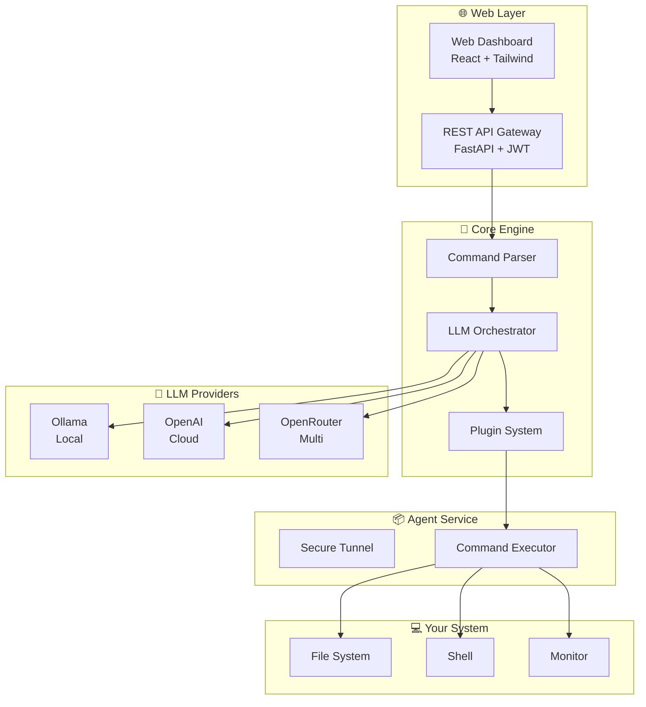
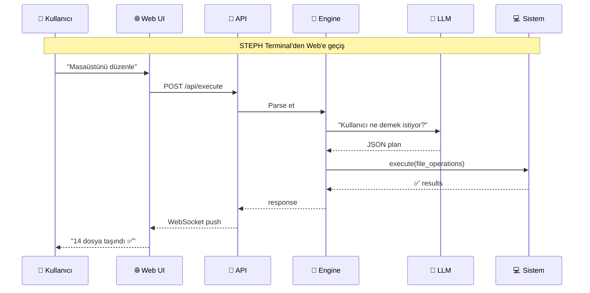
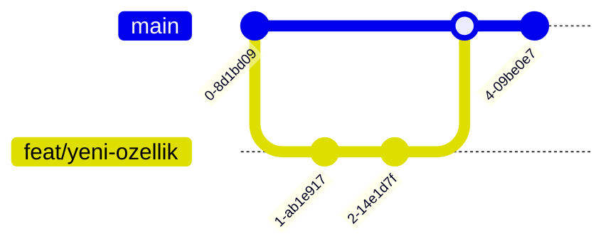

<div align="center">
  

  <br/>

  

  <br/>

  <p>
    
    
    
    
    
    
  </p>

  <p>
    
    
    
    
  </p>

  <br/>

  <!-- Demo GIF placeholder - gerçek kullanım gifi ekleyince daha etkileyici olur -->
  
  <br/>
  <sub>🎥 Canlı demo yakında</sub>

  <br/><br/>

  <!-- Tech Stack -->
  <h4>⚡ Tech Stack</h4>
  <p>
    
    
    
    
    
    
  </p>
</div>

---

## 📋 İçindekiler

<p align="center">
  <a href="#-vizyon">🎯 Vizyon</a> •
  <a href="#-h%C4%B1zl%C4%B1-demo">⚡ Hızlı Demo</a> •
  <a href="#-%C3%B6zellikler">✨ Özellikler</a> •
  <a href="#-mimari">🏗️ Mimari</a> •
  <a href="#-h%C4%B1zl%C4%B1-ba%C5%9Flang%C4%B1%C3%A7">🚀 Başlangıç</a> •
  <a href="#%EF%B8%8F-saas-platform">☁️ SaaS</a> •
  <a href="#-api">📊 API</a> •
  <a href="#-g%C3%BCvenlik">🔐 Güvenlik</a> •
  <a href="#-yol-haritas%C4%B1">📈 Roadmap</a>
</p>

---

## 🎯 Vizyon

<table>
  <tr>
    <td width="60%">
      <h2>Bilgisayarını yönetmenin yeni yolu</h2>
      <p>STEPH, geleneksel işletim sistemi arayüzlerini ortadan kaldırır. Karmaşık menüler, uzun tıklama yolları ve scriptler yerine <b>doğal dil</b> ile bilgisayarını yönetirsin.</p>
      <blockquote><i>"İşletim sisteminin yeni dili: Doğal Dil"</i></blockquote>
    </td>
    <td width="40%" align="center">
      
    </td>
  </tr>
</table>

### Neden STEPH?

| 🚫 Problem | ✅ STEPH Çözümü |
|------------|-----------------|
| Karmaşık menüler, uzun tıklama yolları | Tek cümle ile işlem |
| Script yazmayı bilmeyenler için otomasyon zor | Doğal dil ile otomasyon |
| Sistem yönetimi için teknik bilgi gerekli | AI her seviyeden kullanıcıya hitap eder |
| Farklı araçlar arasında geçiş yapma | Tek platform, her şey |
| Uzak bağlantı için VPN/SSH karmaşası | Web Dashboard ile her yerden erişim |

---

## ⚡ Hızlı Demo

```bash
# 1. STEPH'i çalıştır
$ python main.py

# 2. Doğal dil ile komut ver
You: "Masaüstündeki tüm PDF'leri belgelere taşı"

# 3. STEPH halleder
STEPH: ✅ 14 dosya taşındı, 3 klasör oluşturuldu

# 4. Sorgula
You: "Sistem bilgimi göster"
STEPH: CPU %23 | RAM 6.2/16GB | Disk 340/500GB

You: "100MB üzeri dosyaları bul"
STEPH: 📁 8 büyük dosya bulundu (toplam 4.2GB)

You: "Boş klasörleri sil"
STEPH: 🗑️ 12 boş klasör temizlendi
```

---

## ✨ Özellikler

<div align="center">
  <h3>🔹 Mevcut Özellikler 🔹</h3>
</div>

<table>
  <tr>
    <td width="33%" align="center">
      <h3>🧠</h3>
      <h4>Multi-LLM Desteği</h4>
      <p>Ollama (yerel), OpenAI, OpenRouter, Groq<br/>İstediğin modeli kullan</p>
    </td>
    <td width="33%" align="center">
      <h3>📂</h3>
      <h4>AI Dosya Yönetimi</h4>
      <p>"Masaüstünü düzenle" de<br/>AI kategorize etsin</p>
    </td>
    <td width="33%" align="center">
      <h3>📊</h3>
      <h4>Sistem İzleme</h4>
      <p>CPU, RAM, Disk takibi<br/>Doğal dil ile sorgula</p>
    </td>
  </tr>
  <tr>
    <td width="33%" align="center">
      <h3>🔍</h3>
      <h4>Akıllı Tarama</h4>
      <p>Büyük/eski/tekrar dosyaları<br/>Otomatik bul</p>
    </td>
    <td width="33%" align="center">
      <h3>⚡</h3>
      <h4>Komut Motoru</h4>
      <p>Shell komutlarını<br/>Güvenlik katmanı ile çalıştır</p>
    </td>
    <td width="33%" align="center">
      <h3>🎤</h3>
      <h4>Ses Kontrolü</h4>
      <p>Konuş STEPH yapsın<br/>Yakında</p>
    </td>
  </tr>
</table>

<div align="center">
  <h3>🔸 SaaS Cloud (Çok Yakında) 🔸</h3>
</div>

<table>
  <tr>
    <td align="center">🌐</td>
    <td><b>Web Dashboard</b><br/>Tarayıcı üzerinden makinelerinizi yönetin</td>
    <td align="center">🔗</td>
    <td><b>REST API</b><br/>Her şey API ile kontrol edilebilir</td>
  </tr>
  <tr>
    <td align="center">👥</td>
    <td><b>Multi-Tenant</b><br/>Kurumsal ekipler için rol tabanlı erişim</td>
    <td align="center">📱</td>
    <td><b>Mobil Uygulama</b><br/>Telefonunuzdan bilgisayarınıza komut verin</td>
  </tr>
  <tr>
    <td align="center">📈</td>
    <td><b>Analitik & Raporlama</b><br/>Sistem kullanım raporları, trend analizi</td>
    <td align="center">🔄</td>
    <td><b>Otomasyon Kuralları</b><br/>"CPU %90'ı geçince uyar" gibi akıllı kurallar</td>
  </tr>
</table>

---

## 🏗️ Mimari



### 🔄 Veri Akışı



---

## 🚀 Hızlı Başlangıç

<div align="center">
  <table>
    <tr>
      <th>1️⃣</th>
      <th>2️⃣</th>
      <th>3️⃣</th>
    </tr>
    <tr>
      <td width="33%" align="center"><b>Ollama'yı Kur</b><br/><code>ollama pull llama3.2</code></td>
      <td width="33%" align="center"><b>Projeyi Kur</b><br/><code>pip install -r requirements.txt</code></td>
      <td width="33%" align="center"><b>Çalıştır</b><br/><code>python main.py</code></td>
    </tr>
  </table>
</div>

```bash
# Adım 1: Ollama'yı indir (https://ollama.com/download)
# Adım 2: Modeli çek
ollama pull llama3.2

# Adım 3: STEPH'i kur
git clone https://github.com/Quadraxx/steph.git
cd steph
python -m venv venv
.\venv\Scripts\pip install -r requirements.txt

# Adım 4: Çalıştır
.\venv\Scripts\python main.py

# OpenAI ile kullanmak için:
.\venv\Scripts\python main.py --mode cloud --api-key sk-... --model gpt-4o-mini
```

---

## ☁️ SaaS Platform

STEPH'i bir SaaS olarak da kullanabilirsiniz. Bulut altyapımız sayesinde:

<div align="center">
  <table>
    <tr>
      <td width="33%" align="center" style="background: #f0f0f0; border-radius: 10px;">
        <h3>🆓 Free</h3>
        <h2><sup>$</sup>0</h2>
        <hr/>
        <p>✅ 1 cihaz</p>
        <p>✅ 50 AI sorgu/gün</p>
        <p>✅ Temel komutlar</p>
        <p>✅ Topluluk desteği</p>
        <br/>
        <sub>Başlamak için ideal</sub>
      </td>
      <td width="33%" align="center" style="background: #8A2BE2; border-radius: 10px;">
        <h3>💼 Pro</h3>
        <h2><sup>$</sup>9<sub>/ay</sub></h2>
        <hr/>
        <p>✅ 5 cihaz</p>
        <p>✅ Sınırsız AI sorgu</p>
        <p>✅ Web Dashboard</p>
        <p>✅ API erişimi</p>
        <p>✅ Öncelikli destek</p>
        <br/>
        <sub>🔥 Popüler seçenek</sub>
      </td>
      <td width="33%" align="center" style="background: #f0f0f0; border-radius: 10px;">
        <h3>🏢 Enterprise</h3>
        <h2><sup>$</sup>29<sub>/ay</sub></h2>
        <hr/>
        <p>✅ Sınırsız cihaz</p>
        <p>✅ Özel AI modelleri</p>
        <p>✅ SSO / LDAP</p>
        <p>✅ SLA garantisi</p>
        <p>✅ Özel destek</p>
        <p>✅ Audit logları</p>
        <br/>
        <sub>Kurumsal çözüm</sub>
      </td>
    </tr>
  </table>
</div>

> ⚡ Şu an **beta aşamasında** - Free tier herkese açık!

---

## 📊 API

STEPH tamamen **API-first** mimari ile inşa edilmiştir.

```python
import requests

API_KEY = "your-api-key"
BASE_URL = "https://api.steph.dev/v1"

# Bilgisayarına komut gönder
response = requests.post(
    f"{BASE_URL}/execute",
    headers={"Authorization": f"Bearer {API_KEY}"},
    json={
        "device_id": "pc-001",
        "command": "Masaüstündeki PDF'leri belgelere taşı"
    }
)
print(response.json())
# {"status": "success", "result": "12 dosya taşındı ✅"}
```

| Metot | Endpoint | Açıklama |
|-------|----------|----------|
| `POST` | `/v1/execute` | Komut çalıştır |
| `GET` | `/v1/system` | Sistem bilgisi al |
| `GET` | `/v1/devices` | Cihazları listele |
| `POST` | `/v1/devices/register` | Yeni cihaz ekle |
| `GET` | `/v1/history` | Komut geçmişi |
| `POST` | `/v1/automations` | Otomasyon kuralı oluştur |

---

## 🔐 Güvenlik

Güvenlik, STEPH'in temel tasarım prensibidir.

<table>
  <tr>
    <td align="center">🔒</td>
    <td><b>End-to-End Encryption</b><br/>Tüm komutlar ve veriler şifrelenir</td>
    <td align="center">🛡️</td>
    <td><b>Sandboxed Execution</b><br/>Komutlar izole ortamda çalıştırılır</td>
  </tr>
  <tr>
    <td align="center">📝</td>
    <td><b>Full Audit Trail</b><br/>Her işlem kayıt altına alınır</td>
    <td align="center">🔑</td>
    <td><b>JWT Authentication</b><br/>API erişimleri token bazlıdır</td>
  </tr>
  <tr>
    <td align="center">🎯</td>
    <td><b>Role-Based Access</b><br/>Kullanıcı bazlı yetkilendirme</td>
    <td align="center">⚠️</td>
    <td><b>Command Whitelist</b><br/>Zararlı komutlar filtrelenir</td>
  </tr>
</table>

---

## 📈 Yol Haritası


### 📊 İstatistikler

<div align="center">
  <table>
    <tr>
      <td align="center">
        <h1>⚡</h1>
        <h2>0.1.0</h2>
        <sub>Current Version</sub>
      </td>
      <td align="center">
        <h1>📦</h1>
        <h2>13</h2>
        <sub>Files</sub>
      </td>
      <td align="center">
        <h1>🐍</h1>
        <h2>100%</h2>
        <sub>Python</sub>
      </td>
      <td align="center">
        <h1>🚀</h1>
        <h2>3</h2>
        <sub>Commits</sub>
      </td>
    </tr>
  </table>
</div>

---

## 🤝 Katkıda Bulunun

STEPH açık kaynak bir projedir ve katkılarınızı bekler!



```
1. 🍴 Fork'la
2. 🌿 Branch: git checkout -b feat/yeni-ozellik
3. 💻 Kodla: Değişikliklerini yap
4. 📦 Commit: git commit -m "feat: yeni özellik eklendi"
5. 🚀 Push: git push origin feat/yeni-ozellik
6. 🎉 PR aç
```

---

## 📄 Lisans

<p align="center">
  
  <br/>
  MIT License - Detaylar için <a href="LICENSE">LICENSE</a> dosyasına bakın.
</p>

---

<div align="center">
  

  <br/><br/>

  <p>
    <a href="https://github.com/Quadraxx/steph/issues/new"></a>
    <a href="https://github.com/Quadraxx/steph/discussions/new?category=ideas"></a>
    <a href="https://github.com/Quadraxx/steph/discussions"></a>
  </p>

  <br/>

  <p>
    <a href="https://github.com/Quadraxx">
      
    </a>
  </p>

  <br/>

  <p>
    <a href="https://star-history.com/#Quadraxx/steph&Date">
      
    </a>
  </p>

  <br/>

  <p>
    
    
    
  </p>

  <br/>

  <p>
    <sub>⭐ Beğendiysen yıldız bırakmayı unutma!</sub>
  </p>

  <br/>

  
</div>
